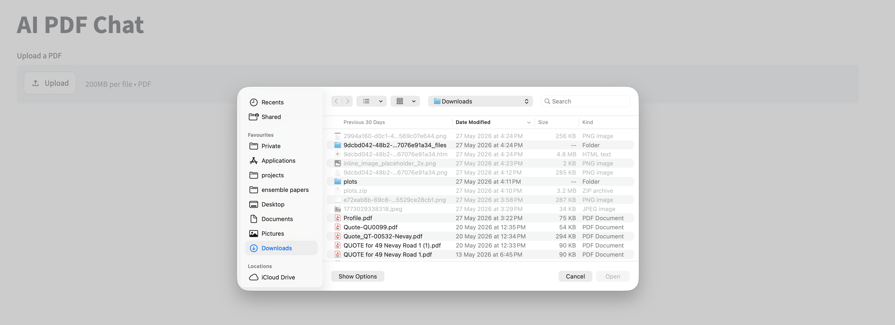
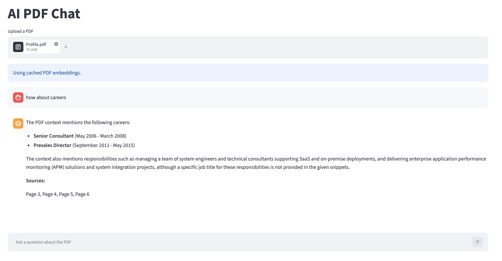
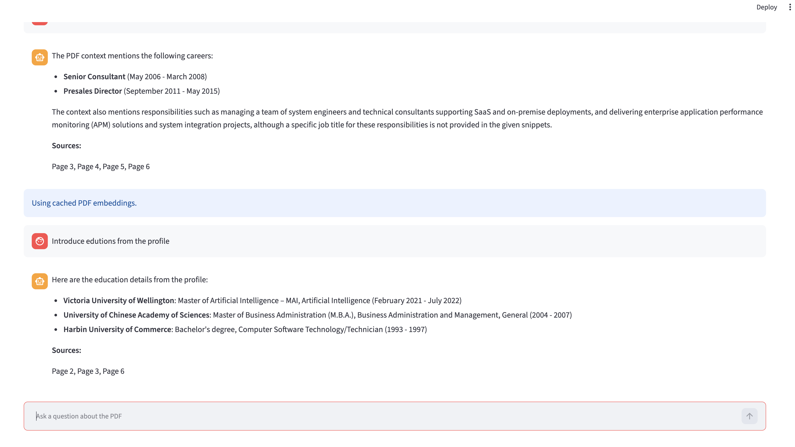

# AI PDF Chat

An AI-powered PDF Question & Answer application built with Python, Streamlit, Google Gemini, and ChromaDB.

## Overview

AI PDF Chat allows users to upload PDF documents and interact with them using natural language questions.

The application extracts text from PDF files, processes the content, and uses Large Language Models (LLMs) to provide accurate answers based on the uploaded document.

This project demonstrates:

* Generative AI integration
* Retrieval-Augmented Generation (RAG)
* Vector Search
* PDF Processing
* Streamlit Application Development

---

## Features

* Upload PDF documents
* Extract text from PDFs
* Ask questions about document content
* AI-generated answers
* Interactive Streamlit interface
* Ready for RAG and vector database integration

---

## Technology Stack

### Frontend

* Streamlit

### Backend

* Python 3.11+

### AI Models

* Google Gemini

### Document Processing

* PyMuPDF (fitz)

### Vector Database

* ChromaDB

---

## Project Structure

```text
ai-pdf-chat/
│
├── app.py
├── requirements.txt
├── README.md
├── .gitignore
│
└── screenshots/
```

---

## Installation

Clone the repository:

```bash
git clone https://github.com/liubruce/ai-pdf-chat.git
cd ai-pdf-chat
```

Create virtual environment:

```bash
python -m venv .venv
source .venv/bin/activate
```

Install dependencies:

```bash
pip install -r requirements.txt
```

---

## Environment Variables

Create a `.env` file:

```env
GEMINI_API_KEY=YOUR_API_KEY
```

---

## Run the Application

```bash
streamlit run app.py
```

Open your browser:

```text
http://localhost:8501
```

---

## Future Enhancements

* Multi-PDF support
* Conversation memory
* Source citations
* Advanced RAG pipeline
* FAISS support
* User authentication
* Cloud deployment

---

## Author

Bruce Liu

* Master of Artificial Intelligence
* Software Engineer
* Machine Learning Enthusiast

---

## License

This project is for educational and portfolio purposes.

## Screenshots

### Upload PDF



### Ask Questions



### Answer with Citations

